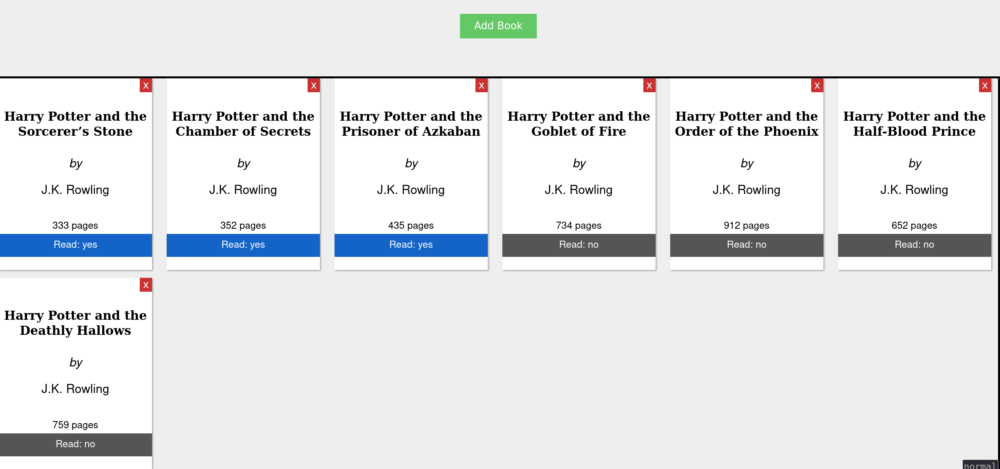
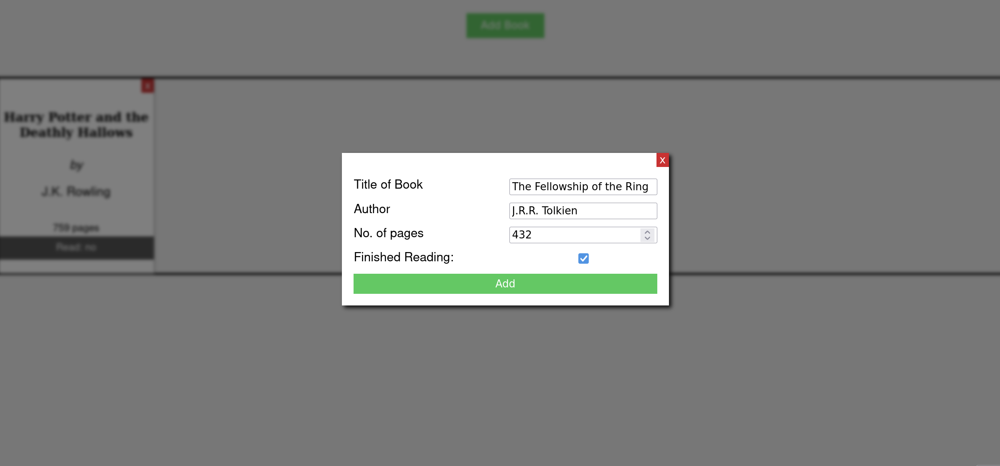

# Simple library
A mini project showcasing a simple library made with html, css and js

- Add new books to the library
- Display added books
- Delete added books
- Toggle Read Status of books from the display
- Interactive UI

## Concepts applied
- Javascript Objects
- HTML Dialogs and Modals

## *The Odin Project* Project
This project was completed as part of [The Odin Project](https://www.theodinproject.com) course curriculum. Do check them out!
